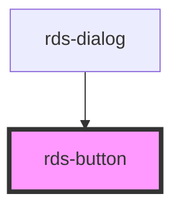

# rds-button

<!-- Auto Generated Below -->

## Properties

| Property    | Attribute    | Description                     | Type                                                                        | Default     |
| ----------- | ------------ | ------------------------------- | --------------------------------------------------------------------------- | ----------- |
| `disabled`  | `disabled`   | Is the button disabled?         | `boolean`                                                                   | `undefined` |
| `fullWidth` | `full-width` | Is the button full width?       | `boolean`                                                                   | `undefined` |
| `size`      | `size`       | How large should the button be? | `"large" \| "medium" \| "small"`                                            | `undefined` |
| `variant`   | `variant`    | What variant to use?            | `"danger" \| "link" \| "primary" \| "secondary" \| "success" \| "tertiary"` | `undefined` |

## Dependencies

### Used by

 - [rds-dialog](../rds-dialog)

### Graph

----------------------------------------------

*Built with [StencilJS](https://stenciljs.com/)*
