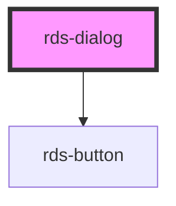

# rds-dialog

<!-- Auto Generated Below -->

## Properties

| Property   | Attribute  | Description          | Type                                                                        | Default     |
| ---------- | ---------- | -------------------- | --------------------------------------------------------------------------- | ----------- |
| `closable` | `closable` | Is the dialog open?  | `boolean`                                                                   | `true`      |
| `heading`  | `heading`  | Props                | `string`                                                                    | `undefined` |
| `isOpen`   | `is-open`  | Is the dialog open?  | `boolean`                                                                   | `undefined` |
| `size`     | `size`     | What size?           | `"large" \| "medium" \| "small"`                                            | `"medium"`  |
| `variant`  | `variant`  | What variant to use? | `"danger" \| "link" \| "primary" \| "secondary" \| "success" \| "tertiary"` | `undefined` |

## Dependencies

### Depends on

- [rds-button](../rds-button)

### Graph

----------------------------------------------

*Built with [StencilJS](https://stenciljs.com/)*
